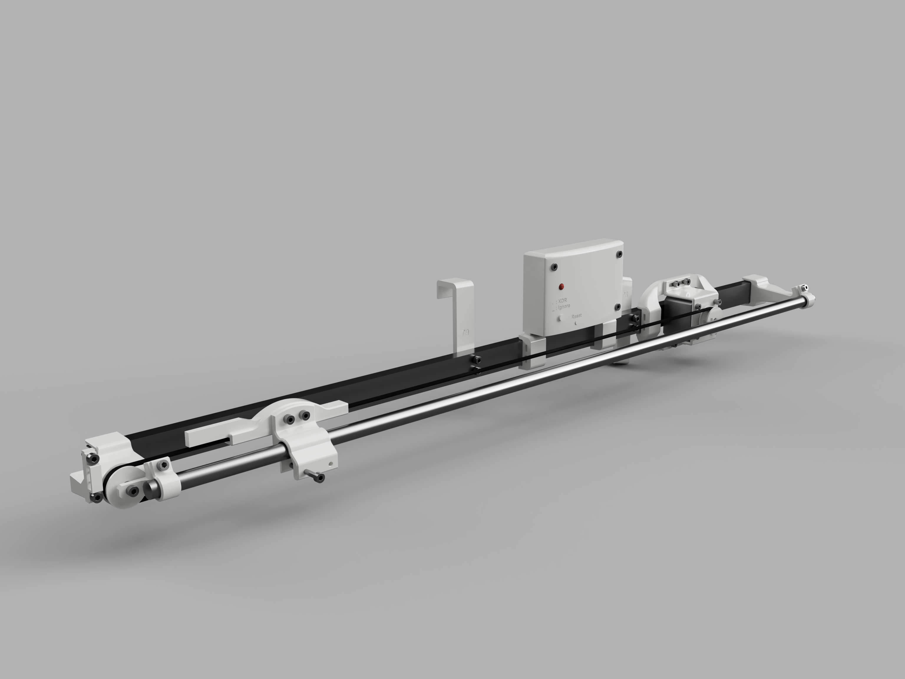
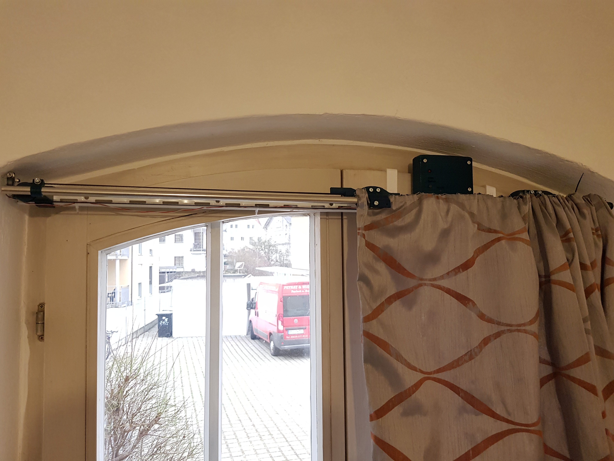

# Window curtain alarm

## Basics
This project aims at creating an alarm that opens and closes a window curtain at certain times each weekday. The system is connected to the local network and is configured using socket communication. The alarm operates independently, it does not require a hub or external control, wake and sleep times can be set for each weekday. An internet connection is required.

## Changelog
* V1.1: Added a locally accessible, basic webpage. Improved 3D files slightly. Minor bug fixes.
* V1.0: Initial release. Controls using a hardware button and a TCP socket.

## Features
### Implemented features
* Automatically keeping track of time
* One wake and sleep time for each weekday
* Belt-driven opening and closing of curtains
* Socket-based user communication
* Local webpage for communication
* Over the air updating
* Button for snoozing one day and manually opening and closing the curtain
* PCB design
* STL files for assembling the project
### Possible future work
* Multiple wake and sleep times for each weekday
* WPS button for easy WIFI connection
* Different endstop locations
* Using more advanced features of the TMC2209 stepper driver (e.g.: sensorless homing)
* Sync multiple curtains 
### Intentional limitations
* Only accessible in the local network
* No secure communication

## Usage
### Setup
Install the system according to the readme in /3D_objects/. Adjust the SSID in the code, compile and upload.
Connect a 5V 2A power supply. Assign a static IP using your router. You will need this IP to configure the system.
The IP is also printed using VCP with 9600 baud at power-up.
### Basic controls using TCP sockets
This alarm can be configured using the telnet protocol. Connect using the IP and port 23 with a client of your choice.
Sending "help" gets a list of example commands.  
Upon powering up, the curtain position has to be calibrated. Open the curtain to the desired position by hand and 
send "calibrate". Make sure the motor moves in the right direction and hits the endstop. 
Now everything should be ready to go. Use "set_wake" and "set_sleep" to set the alarm. Check if the times have been correctly 
set using "waketimes" and "sleeptimes". Check if the right timezone is selected using "curtime".
You can manually move the curtain using "open", "close" or "curtainxor".  

  
   

### Controls using the webpage
With version 1.1, a crude webpage is now available. Please don't judge the interface too harshly. :)  
The webpage is hosted locally and has the same functionality, as the command line style TCP interface. 
D-pad-like buttons allow you to move the curtain, ignore the next wake or calibrate.
Below, the current wake or sleep times are shown and can be changed.
The webpage should work on desktop and mobile. Some of the code has been taken from this [great post](https://gist.github.com/bbx10/667e3d4f5f2c0831d00b).  
You can update code when visiting IP:8000/update!

  
   

### Controls using only the hardware
You can XOR the curtainstate by short pressing the hardware button, long pressing ignores the next wake.
An LED indicates if a short or a long press has been detected.

## Project structure
Here are some directories that may contain interesting files:
* /3D_objects/: 3D-printable objects and installation instructions.
* /course_python_draft/: This quick python prototype aims at visualizing the core concepts and ideas of the project. Untested.
* /curtain_wiring/: A KiCad project for the wiring diagram and PCB design.
* /esp8266_code/actual_project/: The unit tested proof of concept code ported to ESP8266.
* /esp8266_code/test_stuff/: Some quick projects testing basic functionality using the ESP8266.
  * /esp8266_code/test_stuff/socket_test/: TCP socket server test project for the ESP8266.
  * /esp8266_code/test_stuff/motor_test/: Homing and moving using the TMC2209 driver.
* /proof_of_concept/: Unit tested project implementing generic components. This project does not strictly target embedded hardware for ease of building and debugging.
* /pics/: Some pictures and renderings.
* /public/: A website that is able to configure the alarm. Currently on halt.

## Implementation
### Hardware
Opening and closing the curtain shall be done using a belt driven by a stepper motor. A NEMA17 stepper in combination with a TMC2209 driver is currently used. The target platform is the ESP8266. This microcontroller has been chosen instead of a Raspberry PI due to its lower cost and power consumption. 
### Mounting
The hardware, including especially the motor, belt, and endstop, will be mounted using 3D printed objects. Currently, the project is not intended as a 'one design fits all' solution, but will need to be adapted to the used curtain and window.
### Programming language and environment
Due to its dominance in embedded systems and easier debugging, C, instead of C++, is used for most of the more generic project components. These components include user input parsing, keeping track of time, and controlling the IO.
As Arduino and most of its libraries are based on C++, the main function and socket server use this more high-level approach. The PlatformIO IDE and toolchain is used for the ESP8266 code. The proof of concept has been developed using CodeLite.
### Testing
The uCunit framework has been used for unit testing. The framework is basic but very portable and requires only a few header files.
