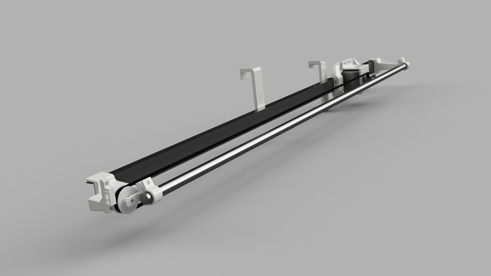

# Window curtain alarm

## Basics
This project aims at creating an alarm that opens and closes a window curtain at certain times each weekday. The system is connected to the local network and is configured using socket communication.

## Features
### Must-have features
* Automatically keeping track of time
* One wake and sleep time for each weekday
* Belt driven opening and closing of curtains
* Socket based user communication
* Button for snoozing one day
* Button for manually opening and closing the curtain
### Possible future work
* Multiple wake and sleep times for each weekday
* WPS button for easy WIFI connection
* Locally hosting a website for more comfortable interaction
* Different end stop locations
### Intentional limitations
* Only accessible in the local network
* No secure communication

## Project structure
Here are some directories that may contain interesting files:
* /course_python_draft/: This quick python prototype aims at visualizing the core concepts and ideas of the project. Untested.
* /esp8266_code/actual_project/: The unit tested proof of concept code ported to ESP8266.
* /esp8266_code/test_stuff/: Some quick projects testing basic functionality using the ESP8266.
	* /esp8266_code/test_stuff/socket_test/: TCP socket server test project for the ESP8266.
	* /esp8266_code/test_stuff/motor_test/: Homing and moving using the TMC2209 driver.
* /proof_of_concept/: Unit tested project implementing generic components. This project does not strictly target embedded hardware for ease of building and debugging.
* /pics/: Some pictures and renderings.
* /public/: A website that is able to configure the alarm.

## Implementation
### Hardware
Opening and closing the curtain shall be done using a belt-driven by a stepper motor. A NEMA17 stepper in combination with a TMC2209 driver are used currently. The target platform is the ESP8266. This microcontroller has been chosen instead of a Raspberry PI due to lower costs and power consumption. 
The target 
### Mounting
The hardware, including especially the motor, belt, and end stop, will be mounted using 3D printed objects. Currently, the project is not intended as a 'one design fits all' solution, but will need to be adapted to the used curtain and window.
### Programming language and environment
Due to its dominance in embedded systems and easier debugging, C is used for most of the more generic project components. These components include user input parsing, keeping track of time, and controlling the IO.
As Arduino and most of its libraries are based on C++, the main function and socket server use this more high-level approach. The PlatformIO IDE and toolchain is used for ESP8266 code. The proof of concept has been developed using CodeLite.
### Testing
The uCunit framework has been used for unit testing. The framework is basic but very portable and requires only a few header files.
